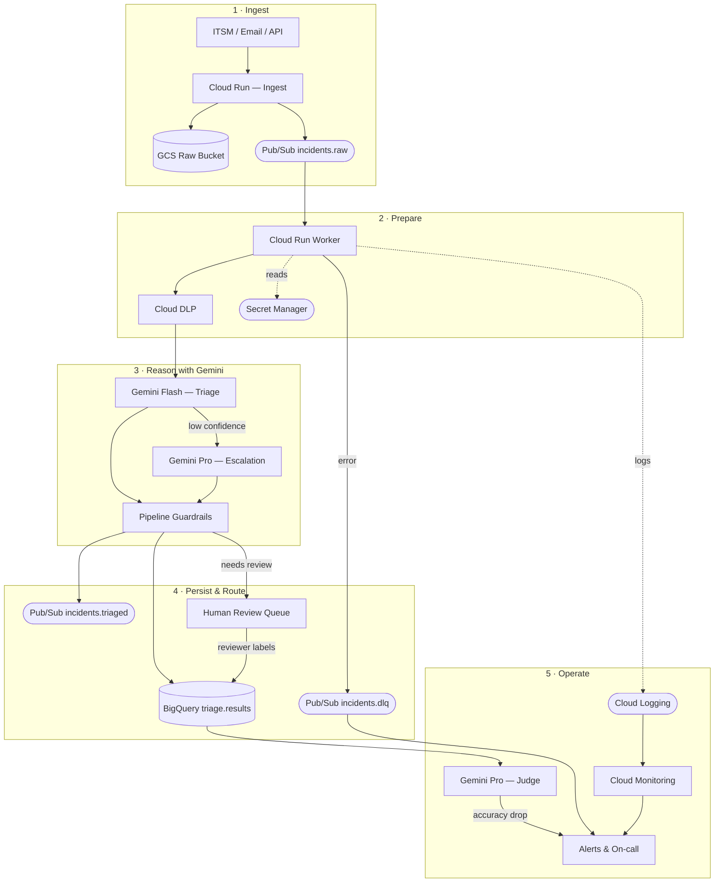

# Incident Triage with Gemini — Proof of Concept

A small, deliberately-scoped AI workflow that turns free-text operational
incidents into a validated, structured triage decision:

```json
{
  "incident_id": "INC-001",
  "category": "network",
  "summary": "All offices unable to reach internal services...",
  "priority": "P1",
  "next_action": "Investigate network / edge connectivity; page on-call SRE.",
  "confidence": 0.88,
  "needs_human_review": false,
  "review_reasons": [],
  "rationale": "Description reports a complete outage across offices...",
  "model_name": "gemini-2.5-flash",
  "prompt_version": "triage-v1.2",
  "processed_at": "2026-08-27T09:41:12+00:00",
  "latency_ms": 813
}
```

The goal was to demonstrate engineering judgment — prompt design, structured
outputs, input validation, hallucination controls, error handling,
observability, PII handling and evaluation — rather than to ship a large
half-finished application. Everything runs offline via a mock Gemini client
so it can be tested without an API key.

---

## Project layout

```
solution/
├── pyproject.toml              # uv-managed project + deps
├── .python-version             # uv reads this (Python 3.11)
├── .gitignore
├── README.md                   # this file
├── docs/
│   └── architecture.md         # GCP architecture Mermaid diagram
├── src/
│   └── incident_triage/        # src-layout package
│       ├── __init__.py
│       ├── schemas.py          # Pydantic models + enums (source of truth)
│       ├── prompts.py          # versioned system + user prompts
│       ├── client.py           # Gemini client + mock + retry
│       ├── pipeline.py         # end-to-end orchestration
│       ├── redaction.py        # PII / secret scrubbing
│       ├── logging_config.py   # JSON structured logging
│       ├── evaluation.py       # golden-set eval harness
│       └── cli.py              # `uv run triage` entrypoint
├── scripts/
│   └── run_demo.py             # `python scripts/run_demo.py` still works
├── data/
│   └── golden_incidents.jsonl  # labelled eval cases
└── tests/                      # 26 pytest tests, all passing offline
    ├── conftest.py
    ├── test_schemas.py
    ├── test_redaction.py
    ├── test_pipeline.py
    └── test_evaluation.py
```

Modules are single-purpose and small; the pipeline module is the only file
that stitches everything together.

---

## Run it (with uv)

[uv](https://docs.astral.sh/uv/) is the toolchain the project targets. If
you don't have it: `curl -LsSf https://astral.sh/uv/install.sh | sh`.

```bash
# Create the venv, install dev deps, wire up the src package
uv sync --extra dev

# Run the golden-set demo (mock Gemini — no key required)
uv run triage

# Golden-set evaluation, JSON report
uv run triage --eval

# Run the tests
uv run pytest -v

# With real Gemini (opt-in extra installs google-genai + python-dotenv)
uv sync --extra live
cp .env.example .env       # then edit .env and paste your GEMINI_API_KEY
uv run triage --live --eval
```

`.env` is gitignored — the key never leaves your machine. The CLI walks up
from the source file to find the nearest `.env` and loads it automatically;
if you'd rather export the variable in your shell, that works too.

If you'd rather not use uv, plain pip works too:

```bash
python -m venv .venv && source .venv/bin/activate
pip install -e ".[dev]"
pytest -v
python -m incident_triage.cli --eval
```

Sample eval output (mock client, 12 golden cases):

```
category_accuracy      : 1.000
priority_within_one    : 1.000
json_validity_rate     : 1.000
deferral_rate          : 0.583
correct_deferrals      : 0.429   ← by design: we defer conservatively
```

---

## Part 2 — engineering decisions

### Prompt design

* Closed vocabularies for `category`, `priority` and `review_reasons`, each
  with one-line definitions in the system prompt (`prompts.py`). The model
  chooses from a list; schema validation catches anything else.
* Explicit "prefer `unknown` + review over fabrication" instruction to
  reduce hallucinated confidence.
* A guardrail block that forbids inventing facts, personal data or actions
  that reference information not in the input.
* Versioned (`PROMPT_VERSION = "triage-v1.2"`) and stamped onto every
  output, so a regression in eval scores can be pinned to a prompt change.

### Structured outputs

* Pydantic `TriageResult` is the single source of truth for what a valid
  output looks like.
* The same shape is passed to Gemini via `response_schema` on
  `GenerateContentConfig` (`pipeline.py`, `GEMINI_RESPONSE_SCHEMA`).
* Parsing goes through Pydantic; invalid outputs fall back to a
  deterministic "escalate to human" result rather than propagating garbage.

### Input validation

* `IncidentInput` enforces required fields, length limits and non-empty
  descriptions.
* Bad inputs are rejected before any tokens are spent.

### Ambiguous / incomplete information

* `Category.UNKNOWN` + `ReviewReason.INSUFFICIENT_INFORMATION` is a
  first-class outcome, not an error path.
* The pipeline forces `needs_human_review = True` whenever category is
  `unknown` or confidence is below the floor (default 0.60), regardless of
  what the model reported.

### Reducing unsupported / hallucinated responses

* Low temperature (0.1) — classification-shaped task, we want stability.
* Constrained-enum outputs — the model literally cannot return a category
  we don't know how to route.
* Confidence floor + forced review on `unknown` — the failure mode of a
  hallucinated but plausible answer is caught at the pipeline layer.
* Prompt explicitly cites "words or phrases from the incident text" in the
  `rationale`, which lets a reviewer spot-check whether the model is
  grounded in the input.

### Error handling

* `_with_retries` (`client.py`) does jittered exponential backoff on
  transient `GeminiError`s. Injectable `sleep` and `rng` make it unit-testable.
* One corrective retry with a stricter reminder if the first response fails
  schema validation.
* If everything fails, a deterministic fallback result is emitted with
  `needs_human_review = True` — the pipeline never returns an unparseable
  value.

### Logging / observability

* `logging_config.py` provides a small JSON formatter and a `bind_context`
  helper that stamps `trace_id`, `incident_id`, `prompt_version` and
  `model` onto every event.
* Emitted events: `triage_started`, `redaction_applied`,
  `model_response_missing_fields`, `model_call_failed`,
  `output_validation_failed`, `triage_completed`.
* Every result carries `model_name`, `prompt_version` and `latency_ms` so
  downstream dashboards can slice by model version or prompt revision.

### Security and sensitive data

* Best-effort PII / secret redaction in `redaction.py` (email, phone, IPv4,
  Luhn-valid card, JWT, AWS keys, generic API-key patterns) *before* the
  incident text is sent to Gemini.
* Any redaction hit forces `possible_pii` + human review — a reviewer sees
  the unredacted record via a controlled UI.
* Redaction is defence-in-depth. In production it sits alongside Cloud DLP
  (see below).

### Basic testing / evaluation

* 26 unit tests cover schemas, redaction, retry, safety overrides,
  fallback detection and end-to-end pipeline behaviour.
* `evaluation.py` implements a golden-set harness that reports category
  accuracy, per-class F1, priority-within-one, deferral rate, correct
  deferrals, JSON validity rate and average latency.

---

## Part 3 — Production design on GCP

Open `docs/architecture.md` for the polished Mermaid architecture diagram.
Compact version:



**Where Gemini is used** — three places, one model family:

1. **Triage (Flash)** — every incident. Called with `response_schema` and a versioned prompt.
2. **Escalation (Pro)** — only when Flash returns confidence < 0.60 or category `unknown`. Roughly 10 % of traffic.
3. **Judge (Pro)** — nightly LLM-as-judge over the golden set and a 2 % production sample. Scores `next_action` quality and rationale groundedness. This is what makes observability more than latency graphs: deterministic metrics like F1 can't score open text, but a second Gemini call with a scoring rubric can.

Written summary:

| Concern | Choice | Alternatives considered |
| --- | --- | --- |
| **Ingest** | Cloud Run HTTP endpoint + Pub/Sub topic `incidents.raw` | Direct Cloud Functions (fine for small volumes; Cloud Run scales better and gives us CPU sizing) |
| **Buffer** | Pub/Sub | Cloud Tasks (simpler but weaker retry semantics; Pub/Sub gives dead-letter topics for free) |
| **PII scan** | Cloud DLP inspect + our own regex pass | Regex-only (misses masked/format variations); DLP-only (higher latency, cost) |
| **Processing** | Cloud Run worker subscribed to `incidents.raw`, pushes results to `incidents.triaged` | Cloud Functions Gen 2 (fine, but Run's request-based scaling matches our throughput profile better) |
| **LLM** | Vertex AI Gemini (`gemini-2.5-flash` for volume, `gemini-2.5-pro` fallback on low-confidence) | AI Studio direct API (less enterprise-friendly for audit; no VPC-SC) |
| **Structured store** | BigQuery table `triage.results` partitioned by day, clustered on `category` | Firestore (fine for lookups; poor for slice-and-dice analytics we need for eval) |
| **Raw store** | Cloud Storage bucket `triage-raw-<env>` with CMEK + object retention | Store raw text in BQ (bloats the analytical warehouse with sensitive blobs) |
| **Human review UI** | Simple internal web app on Cloud Run, pulls from `triage.results WHERE needs_human_review` | Off-the-shelf ticketing integration (Zendesk / ServiceNow) once volumes and workflows justify it |
| **Dead letter** | `incidents.dlq` Pub/Sub topic + alert on backlog | Ignore + Cloud Run auto-retries (loses failures silently) |
| **Secrets** | Secret Manager for the Gemini API key (or Workload Identity + Vertex service account) | Env vars (auditable, but rotation is painful) |
| **Monitoring** | Cloud Logging (structured JSON already), Cloud Monitoring dashboards, Error Reporting | Third-party APM (adds a vendor for no unique gain at PoC scale) |
| **Alerting** | Alerts on DLQ backlog, deferral-rate delta week-over-week, p95 latency, error rate | On-call rotation via Cloud Monitoring notification channels |

**How data flows**

1. Client / ITSM connector `POST`s an incident to Cloud Run ingest.
2. Ingest validates the JSON, drops the raw payload into GCS (CMEK), and
   publishes an event to `incidents.raw` referencing the GCS blob.
3. Worker Cloud Run instance pulls the message, runs Cloud DLP, then the
   Python pipeline in this repo.
4. Result written to BigQuery. If `needs_human_review` is true, an insert
   also lands in the human-review queue table read by the review UI.
5. Failures land in `incidents.dlq` with the original message and the
   exception; a Cloud Function replays them on a schedule after the fix.
6. Cloud Logging picks up the structured events; a Monitoring dashboard
   tracks deferral rate, per-category counts, p95 latency, DLQ depth.

**Where human review fits**

* Explicit deferrals (`needs_human_review = true`) go to a review queue
  and never auto-resolve. The reviewer's decision is written back to
  `triage.results` as a *labelled* record — this becomes new eval data.
* A random sample (say 2%) of *non-deferred* results is also queued for
  spot-check review, so we can measure real-world accuracy on the cases
  the model thought were easy. Without this we would be blind to
  overconfident errors.
* Reviewer decisions on the sampled cases feed a nightly job that
  recomputes the golden-set eval, so accuracy is tracked over time and
  triggers a rollback alert if it drops by more than a set threshold.

---

## Part 4 — Evaluation strategy

**What a "good" output looks like**

* Category matches the label used by a human triager on the same text.
* Priority is within one band of the human's priority (P2 vs P3 disagreements
  are rarely worth a review).
* Structured output validates against the schema on the first try.
* When the model was uncertain, it either got the answer right *or* it
  correctly asked for human review. False confidence is the failure mode
  we care about most.

**Building an evaluation dataset**

1. Seed set of ~100 historical incidents from the ticketing system, labelled
   by a senior operations engineer, stratified by category.
2. Adversarial set: intentionally ambiguous / mixed-signal / empty /
   PII-containing incidents, labelled with the *expected* deferral.
3. Ongoing set: the reviewer decisions from production (from the review
   queue and the 2% spot-check sample) become new eval rows nightly.
4. Version the dataset in Git alongside the code; every eval run is
   reproducible.

**Metrics we would track**

* Micro-averaged category accuracy.
* Per-class F1 — mainly to catch a model that is good overall but blind
  to `security`.
* Priority-within-one.
* JSON validity rate (should be ~1.0 with response_schema; regressions
  usually mean a prompt or SDK change).
* Deferral rate + correct-deferral rate. Deferring too often is
  operationally expensive; deferring too rarely is dangerous.
* Cost per incident and p95 latency.

**Errors that would worry me most**

1. Confident wrong category on `security` — could mean an incident that
   should page on-call gets routed to a slow queue. Mitigation: force
   review whenever category is `security`, regardless of confidence.
2. Confident wrong priority upgrade to P1 — noisy paging destroys on-call
   trust. Mitigation: guardrail in the prompt about impact language, and
   an alert if the model's P1 rate jumps week-on-week.
3. PII in the summary or rationale. Mitigation: pre-redaction, plus a
   secondary DLP scan on the *output* before it lands in BigQuery.
4. Silent shift after a prompt change. Mitigation: prompt versioning +
   nightly eval + rollback alert.

**When the system should defer to a human**

Any one of these triggers deferral in the current pipeline:

* Confidence < 0.60.
* Category is `unknown` or `security`.
* PII / secrets detected in the input.
* Output failed schema validation twice (fallback path).
* Conflicting signals in the description (model may raise this reason).

**Monitoring in production**

* Cloud Monitoring dashboard: per-category volume, deferral rate,
  confidence histogram, p95 latency, DLQ depth, error rate.
* Weekly report from the nightly eval job (accuracy trend line, F1 per
  class, deferrals).
* Alert conditions: category accuracy drop > 5 % week-over-week, DLQ
  backlog > 100 messages, p95 latency > 8 s, deferral rate outside its
  seasonal band.

---

## Where this evolves next (agentic)

The challenge asked for a workflow, not an agent, and for triage a
well-scoped workflow is the right first step. The next natural extension
turns the workflow into a small tool-using agent by giving it three
functions:

1. `search_similar_incidents(text)` — vector-store lookup against
   embeddings of past resolved incidents in BigQuery, so triage can cite a
   prior root cause when one exists.
2. `check_service_status(service_name)` — calls the ops health API and
   returns known outages, so the model can defer to a live signal instead
   of guessing.
3. `open_ticket(category, priority, summary)` — the terminal tool, once
   confidence is high enough.

The scaffolding here already fits: Gemini's function calling would be
wired through the same `client.py`, the schema stays the source of truth
for what a triage decision looks like, and the review queue still handles
low-confidence cases. Vertex AI Agent Builder or a lightweight
LangGraph-style orchestrator both fit; the choice depends on how much
process-transformation glue lives around the agent versus how much the
agent owns end-to-end.

---

## What is deliberately not here

* No real cloud infrastructure — the challenge says to mock it, and I
  focused effort on the workflow instead. `docs/architecture.md` shows
  how the pieces would connect.
* No fine-tuning or embedding-based retrieval — for triage a well-designed
  prompt over Gemini flash is the right first step; fine-tuning is only
  worth it after we've saturated prompt-only performance.
* No fancy eval framework — 100 lines of Python that print the metrics
  above answers the question the challenge asks. A more sophisticated
  version would layer LLM-as-judge scoring on top for open-text fields
  like `next_action`, using a separate judge model with its own rubric.
