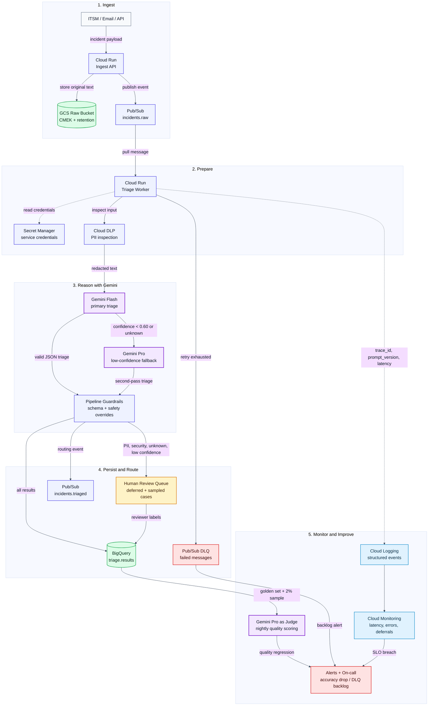

# Incident Triage - GCP Production Architecture

This diagram shows how the proof of concept can scale to thousands of
operational incidents per day on Google Cloud. It keeps the AI workflow
auditable: every Gemini call is schema-constrained, every risky case can defer
to a reviewer, and reviewer decisions feed the evaluation loop.

## Why This Design

| Area | Choice | Why it fits |
| --- | --- | --- |
| Ingest | Cloud Run + Pub/Sub | Separates request handling from AI processing, so traffic spikes and Gemini quota issues do not drop incidents. |
| Raw storage | Cloud Storage | Keeps original incident text in a controlled bucket with CMEK and retention, instead of bloating BigQuery with sensitive blobs. |
| PII handling | Cloud DLP + local redaction | DLP catches broad sensitive-data patterns; local redaction protects the synchronous path before Gemini. |
| AI model | Vertex AI Gemini Flash, with Pro fallback | Flash handles high-volume classification cheaply; Pro is reserved for low-confidence or ambiguous cases. |
| Structured output | Gemini `response_schema` + Pydantic validation | The model must return the known taxonomy; invalid output retries once, then defers to a human. |
| Human review | Queue for deferred and sampled cases | Explicit deferrals are reviewed, and a small sample of confident cases catches overconfident errors. |
| Evaluation | BigQuery + nightly Gemini-as-judge | Deterministic metrics cover category and priority; judge scoring covers open text like `next_action`. |
| Monitoring | Cloud Logging + Cloud Monitoring | Dashboards track latency, error rate, deferral rate, category mix, and DLQ backlog. |

## Human Review Rules

The pipeline should defer to a reviewer when any of these conditions apply:

- Confidence is below `0.60`.
- Category is `unknown`.
- Category is `security`.
- PII or secrets were detected in the input.
- The model output failed schema validation twice.
- The model reports conflicting signals or insufficient information.

Reviewer labels are written back to BigQuery and become part of the next
evaluation dataset.
